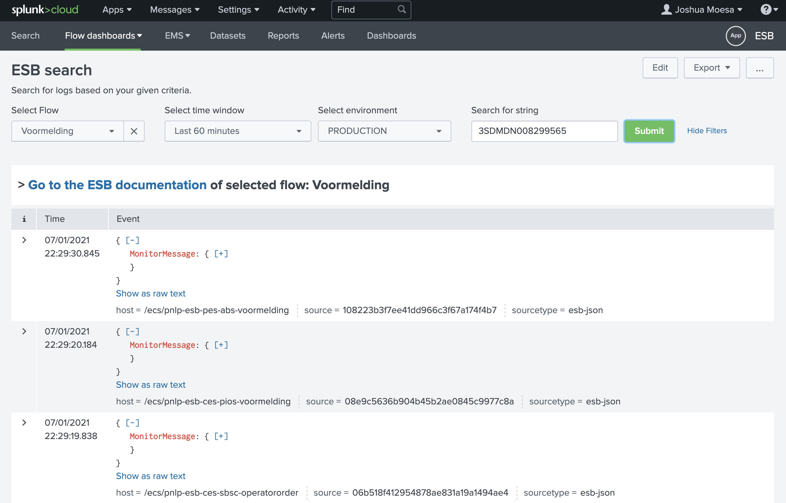
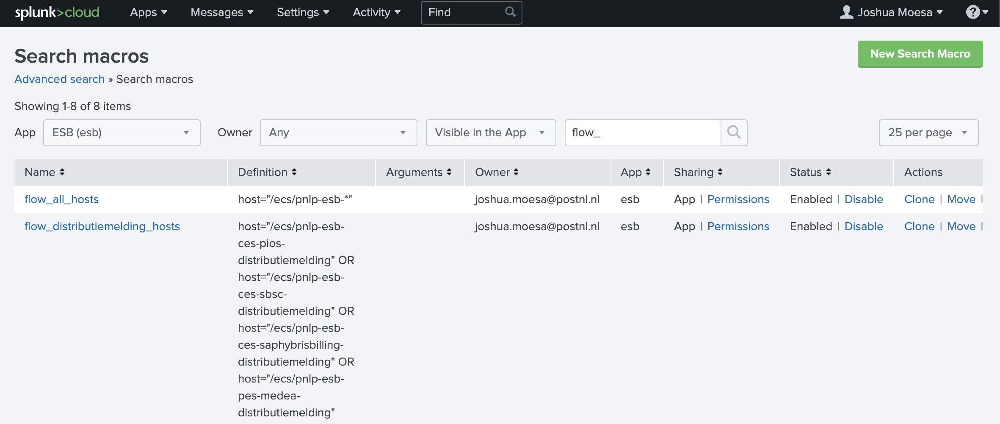

# esb_search

Search for logs based on given criteria given by the dashboard user:
- All logging or within a specific flow (currently a limited set of flows)
- Time
- Environment (currently only on Production)
- Search string (optional)

When a specific flow is selected, the visible link 'Go to the ESB documentation' below the criteria bar will direct the user to the flow documentation on Confluence.

## Search result example

## Additional notes

###  Search macro

When user selects a specific flow to search in, irrelevant logging is filtered out using Splunk Search Macros. Search Macros are maintained in Splunk and are found under Settings > Advanced Search > Search macros. Screenshot: 

